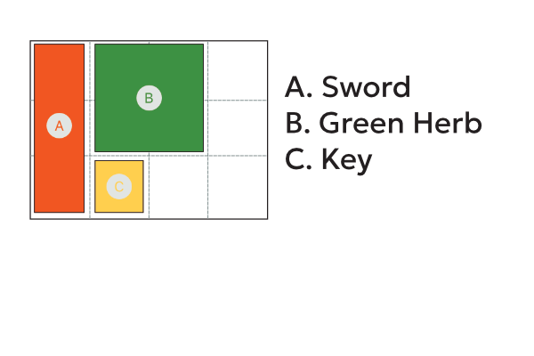

# Grid Based Inventory System - A Problem
`15/10/2024`
`16/10/2024`

## Introduction
So I was watching a video called Code Organization by Tim Cain ([link](https://www.youtube.com/watch?v=Zzo5JTY8zjg)), and in this video he discusses how to organise code (obviously) using the example of an inventory system and he discussed the idea that code used to manage the inventory should be seperated from the code that displays it as UI. I found this to be an intresting idea and, from my experience, it sounds like the correct idea. Delegation of concepts and code is an important part of developing any software and designing structures. So I began thinking about this further and decided to figure out a solution to an idea that Tim talked about in the video; how would you implement a grid based inventory (think Diablo 2 or Resident Evil 4) using this deligated structure. 

Now at the time of writing I don't have a game I am working on, so lets work on this idea as a more generalised problem and develop it using the code in a demonstrative way rather than a practical solution to a real world game.

First we should layout the necessary components and the minimum product, we need:
- A data structure capable of holding items with no context of how they are displayed
- An object that stores the item and any additional information that is required
- A system able to store those items in a grid of any size
- A UI system which displays those items and allows for a simple drag and drop interface to move them

## The Overview
My first thought is to build the structure of the inventory system in the software but following this idea will lead to a high level of coupling between our inventory system and user interface, something that this thought experiment is trying to avoid so instead lets start simply;

This is the goal, but lets seperate the layout from the code. We will use python as our code 